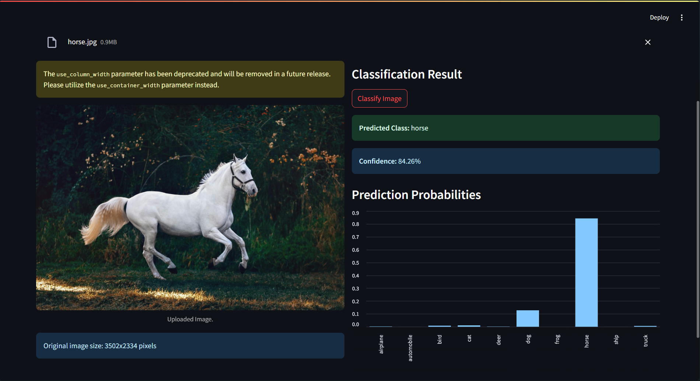

# 🖼️ CNN Image Classifier for Animals & Traffic

A simple and interactive web application built with Streamlit and TensorFlow that classifies uploaded images into one of 10 categories, including animals and vehicles.

[](https://www.python.org/)
[](https://www.tensorflow.org/)
[](https://streamlit.io/)
[](https://opensource.org/licenses/MIT)

## 🌟 Key Features

-   **Interactive UI:** Upload your own images through a simple drag-and-drop interface.
-   **Real-time Classification:** Get instant predictions powered by a Convolutional Neural Network (CNN).
-   **Probability Analysis:** View the model's confidence score and the probabilities for all possible classes in a bar chart.
-   **Built on CIFAR-10:** The model is trained on the well-known CIFAR-10 dataset.

## 🚀 Live Demo

Here is a screenshot of the application in action. The model correctly identifies the uploaded image of a truck.

[Image of a Streamlit web app in action]


*(To add your own image here, take a screenshot of your running app, save it as `demo.png` in your project folder, and it will appear here automatically.)*

## 🛠️ Technologies Used

-   **Backend & Model:** TensorFlow, Keras
-   **Frontend Web App:** Streamlit
-   **Data Handling:** NumPy, Pillow (PIL)
-   **Dataset:** CIFAR-10

## ⚙️ Setup and Installation

To run this project locally, follow these steps:

1.  **Clone the repository:**
    ```bash
    git clone [https://github.com/your-username/your-repo-name.git](https://github.com/your-username/your-repo-name.git)
    cd your-repo-name
    ```

2.  **Create a virtual environment:**
    ```bash
    python -m venv venv
    source venv/bin/activate  # On Windows, use `venv\Scripts\activate`
    ```

3.  **Install the required libraries:**
    ```bash
    pip install -r requirements.txt
    ```

## ▶️ How to Run

1.  **Train the Model (if the `.h5` file is not present):**
    First, run the training script to generate the `cifar10_classifier.h5` model file.
    ```bash
    python train.py
    ```

2.  **Launch the Streamlit App:**
    Once the model is saved, run the Streamlit app.
    ```bash
    streamlit run app.py
    ```
    Your browser will automatically open with the running application.

## 📁 Project Structure